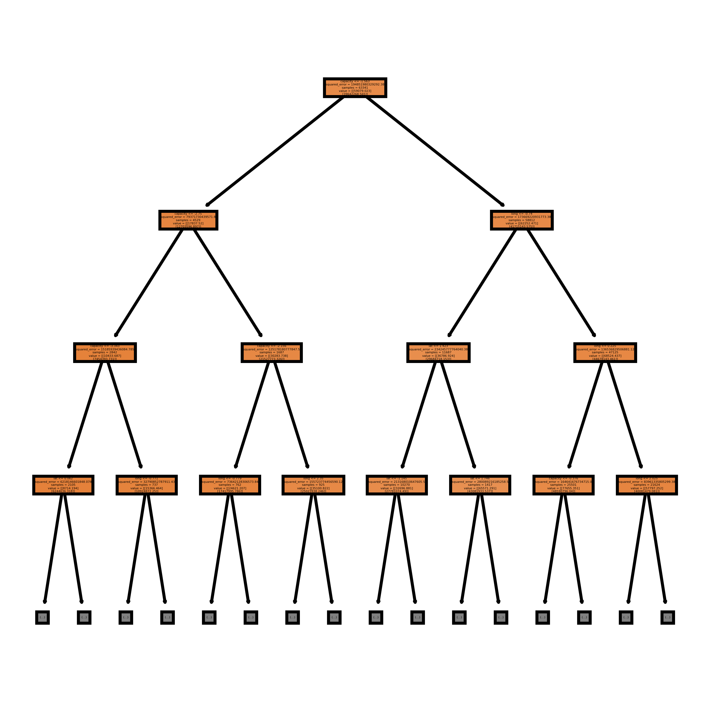
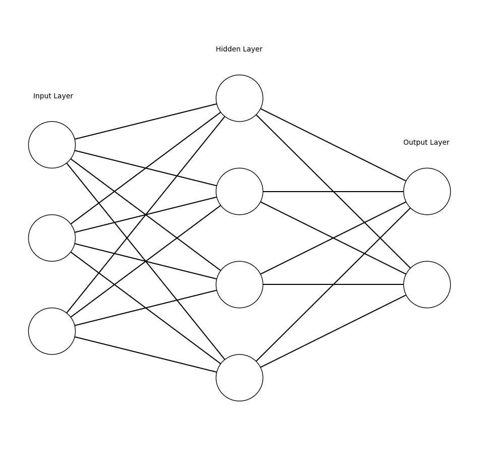
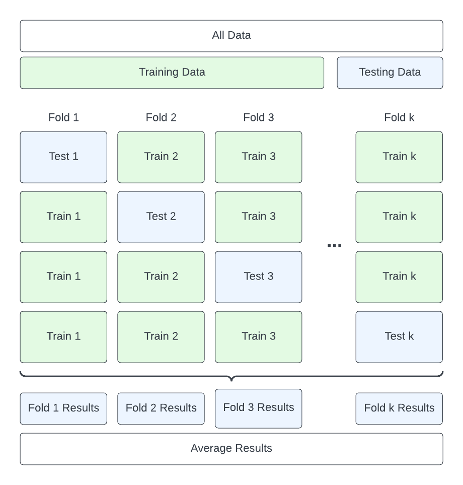
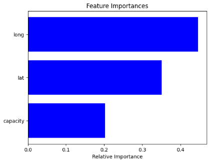
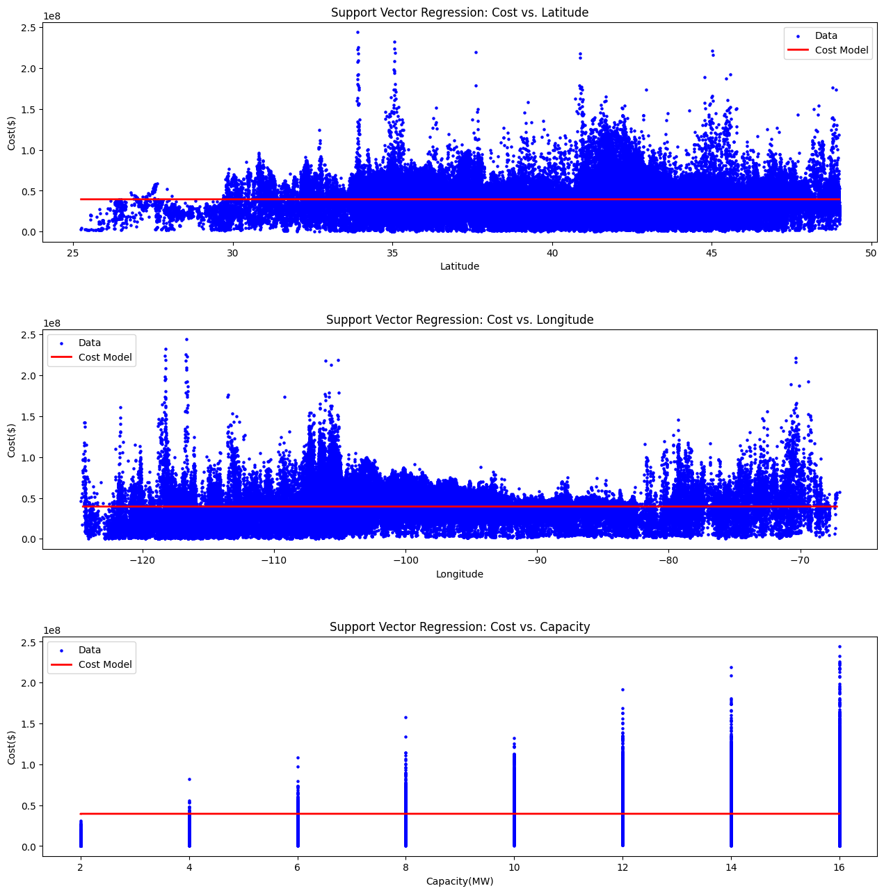
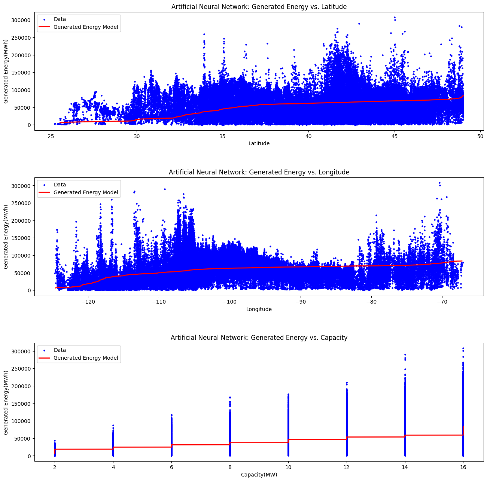

# Introduction

In an era marked by unprecedented environmental challenges, the imperative to address the impacts of climate change has become increasingly urgent. As our planet struggles to persist in a healthy state as a result of the tumultuous onslaught brought on by rising global temperatures, extreme weather events, and ecological disruptions, the necessity for a pursuit of a sustainable future has never been more prevalent. In this pursuit, renewable energy has seated itself as a pivotal solution to mitigate the environmental effects of traditional energy production. Among these alternatives, green energy arrays, comprising of solar and wind technologies, hold immense promise. The venture to harness the true potential that these technologies hold, however, comes at the cost of needing a nuanced understanding of certain geographic factors that influence their performance and cost-effectiveness. This project embarks on a pioneering exploration, marrying geographic data with advanced machine learning models, to offer a holistic perspective on the viability and economic implications of green energy arrays.

## Motivation

It goes without question that the Earth is warming at an abnormal rate compared to years prior. The source of the obscure warming period we, as a society, are experiencing is highly debated in fields ranging from politics, to economics, and even to education. However, there is clear evidence, seen in the results of numerous studies, that emphasize human contributions, which go as far as to prove humans are furthering the negative effects of climate change through the escalation of global temperatures. Prolonged temperature observations serve as the most persistent evidence of climate change [@21558]. Imperious is the effect of temperature on multiple aspects of human society and the environment such as agriculture, human health, water, infrastructure, and ecosystems. Temperature is the governing factor when it comes to consequences of climate change, and it has only been increasing. For perspective, the global annually averaged surface air temperature has risen by 1.8$^{\circ}$F (1.0$^{\circ}$C) over the last 115 years [@21558]. This drastic increase in temperature has now marked the current period as the warmest in modern civilization's history [@21558]. More specifically, for the period 1986-2016 relative to 1901-1960, the global annual average temperature has increased by more than 1.2$^{\circ}$F (0.7$^{\circ}$C). Surface temperatures worldwide have also increased by up to 3.0$^{\circ}$F in some areas of the globe [@21558].

![The left panel indicates global average temperature readings relative to the 1901-1960 average. It showcases an overall increase over a span of about 120 years. Red bars represent temperatures higher than the average, while blue bars represent those that are lower than average [@21558]. The right panel indicates surface temperature changes (in $^{\circ}$F) for the period 1986-2016, relative to the same average. Gray represents missing data [@21558].](images/es-1.png)

The parallel between the time period which dictates the greatest increase in warming, and the time period in which humans have seen substantial growth in technology and infrastructure, is no coincidence. In fact, society is acting perilously regarding the state of our world through the widespread technological advances made in recent years. Greenhouse gasses are the most impactful byproduct of this activity, as the magnitude of climate change is wholly dependent on the amount of heat-trapping gasses released globally [@21558]. Much of the damage is already done, but efforts to mitigate these effects are not, and will not be fruitless. It can be observed that if no changes are made to our emissions, the side effects get exponentially worse, while if changes are made and emissions are cut to the bare minimum, then damage to the planet will not grow, and instead will taper off until the Earth naturally rebalances itself [@21558].

![The left panel shows annual historic range of plausible future carbon emissions per year. The right panel shows historically observed temperature changes and future temperature changes as a result of a set of future scenarios relative to the 1901-1960 average [@21558]. In combination, a correlation is seen that suggests the severity of carbon emissions maps directly to temperature change.](images/es-3.png)

With this information, the culprit becomes identified: the burning of fossil fuels that release greenhouse gasses. Over 70% of global greenhouse gas emissions come from the energy sector [@owid-ghg-emissions-by-sector]. These emissions are responsible for powering the worldwide manufacturing processes we take advantage of every day, powering the transportation industry that we abuse to travel back and forth from our daily commutes, and powering residential and commercial buildings, which we take for entirely granted. Nearly 80% of global primary energy comes from high-carbon sources [@owid-energy-mix]. Such high usage of fossil fuels points to one clear solution, the implementation of rapidly growing, low-carbon energy sources, which take the form of renewables like wind and solar [@owid-energy-mix]. However, installing renewables is no easy task.

In fact, renewable energy is difficult to install due to a large collection of barriers that get in the way of a process that is ultimately beneficial for the whole. Five of these barriers present themselves as the leading blockades to low-carbon installations. These include economic barriers, knowledge barriers, social barriers, organizational barriers, and installation-related barriers [@REINDL2021110829] [@Mastoi2023]. Each barrier carries with it its own set of divisions that better define it, but ultimately, each barrier can be mostly resolved simply through access to valuable resources and data [@REINDL2021110829]. Geographic data, economic data, and energy data offer substantial insights into how each of these barriers can be torn down, allowing for the installation of renewable energy, which, in turn, leads to less harmful climate impacts. This project will take advantage of this truth to produce a tool that both accesses and produces the aforementioned data for both private companies and the general public to use to gain key insights into factors that aid in the installation of low-carbon energy production technologies.

## Goals of the Project

As important as the tool itself is for assisting in furthering progress towards reducing emissions, it becomes somewhat of a byproduct in comparison to what this research specifically investigates. As it turns out, the accuracy of a machine learning model is the most important factor to consider when determining whether or not a model can be trusted [@10.1145/3290605.3300509]. Many products that exist in the world today that offer insights into data regarding renewable energy installations use highly complex models that are created and trained purely for the purpose of predicting energy data [@osti_1440404] [@Mermoud_Villoz_2023] [@Westbrook_Macpherson_Desharnais_2021]. As a result, these models are incredibly accurate, but they bring with them a high barrier to entry [@osti_1440404] [@Mermoud_Villoz_2023]. This research explores the expansion of those resources by presenting the use of less complex, but more efficient models. Specifically, this project determines if the use of lower stakes models produces results that are similar in levels of accuracy to the more complex models that are already in circulation.

The presented tool utilizes advanced machine learning algorithms to produce predictions of geographic, economic, and energy data through the use of locational data and array size as inputs. Results produced by these models are then rigorously tested for accuracy to ascertain the viability of this approach. In the end, the resources and predictions generated by the tool would serve to supply information about how potential renewable energy arrays would perform, and how much they would cost to produce. This can then be used to break down those barriers, leading to positive climate impacts. More importantly, this work unearths which of the chosen machine learning algorithms, if any, produce viable and accurate results when modeling data of this type.

## Ethical Implications

This project also has the potential to carry with it negative side effects if misused, or abused, or just by nature of the field in which work in renewables operates. One of these side effects persists of the land use impacts that green energy arrays carry with them. This is important to consider as, if the tool developed from this work is used to promote, plan, and construct renewable energy solutions, then the spatial extent of these technologies plays a meaningful role in the lives of individuals and the environment. By nature, low-carbon energy sources have lower power densities than their non-renewable, high-carbon counterparts [@VANZALK201883]. Each array then requires more land area to produce similar amounts of energy, leading to estimates that dictate that significant portions of land will be occupied by renewable energy systems [@VANZALK201883]. Worries become even more prevalent as the political climate shifts towards mandating the installation of these technologies. California Senate Bill 100 does just this, by committing the state to achieving 100% clean energy in all sectors by 2045 [@SCHULTE201931]. This could lead to monumental land use impacts that could displace individuals, unjustly occupy land, and destroy the environment, due to incentives to install more renewables. Given the scenario where this tool is used similarly, it could also indirectly perpetuate these same injustices.
 
Land use is not the only transgression that the promotion, production and installation of renewables can perpetrate, however. The materials needed to create the solar panels and wind turbines that could be installed through the use of this project's tool pose severe threats to environmental health, and, subsequently, human health [@Sonter2020]. Mining for the vast array of resources needed for low-carbon installations potentially influences 37% of Earth's terrestrial land area under some assumptions, which has large impacts on biodiversity by the way of habitat loss and ecosystem destruction [@Sonter2020]. Furthermore, each resource being mined carries with it its own set of risks for the worker(s) extracting the minerals. Risks mainly manifest themselves as direct health issues like respiratory impacts, cancers, or other mining related injuries [@Stephens2001WorkerAC]. When it comes to mining, it is also important to discuss the social impacts that mining can have on certain communities. Peru showcases how mining affects the life of individuals societally by presenting large economic disparities based on geographic distance to mining centers [@LOAYZA2016219]. Taking these impacts into consideration, considerable controversy can be identified and applied to the installation of renewable sources.

This project seeks to mitigate ethical issues, like those outlined above, as much as possible. But in this case, any attempt to address these ethical concerns within the scope of this research, would only limit the potential of the project. As many of the most important ethical issues that can be derived from the use of this tool are unintended consequences that stem from the field of renewable energy in general, the most effective way to help lessen the impacts would be to heavily advocate for the use of this tool by individuals and organizations that commit themselves to sustainable practices. However, limiting the use of this tool would then undermine the main purpose of this research. It seems that the efforts to limit the negative consequences must be addressed by the community as a whole, instead of within the scope of this project.

# Related Work

In this section, we provide a comprehensive review of some of the most prominent, existing tools and research that concerns modeling the performance and cost of low-carbon technologies, such as solar and wind power. We discuss their functionalities, strengths, weaknesses, and limitations, as a way to examine the various tools and research extensively. Analysis of the work in question serves two purposes: first, to provide a nuanced understanding of the existing landscape, and second, to aide in the identification of relevant and important gaps that serve as the focal point of this research. Subsequent to this evaluation, bespoke solutions are brought to light and, through the assistance of more academic literature, are intricately intertwined to provide a pathway for this project to fill the aforementioned gaps, and to supply a new solution to help overcome barriers to installations, as well as to assist in tackling the issue of climatic change.

## Existing Tools

The field of this research has seen many major strides regarding tooling that gives access to crucial information that is needed when considering, planning, installing, and maintaining renewable energy arrays. Much of the work is focused around assisting in the planning and installation process, which serves to overcome many of the barriers that present themselves when implementing renewable energy. These barriers get broken down by various methods depending on the tool being used. For example, some tools use complex analysis to provide the most accurate predictive models, dependent on hundreds of input parameters to ensure an array is as efficient and bankable as possible. On the other hand, some tools barely scratch the surface, supplying a very high-level analysis of an array, only making note of its potential energy output. Nonetheless, the collection of the most popular tools that exist serve to offer a range of experiences that provide the most relevant information based on what a user needs.

One of the most impactful contributors to this field is the National Renewable Energy Laboratory (NREL). The researchers at the NREL strive to produce accurate and useful tools and data for a wide range of consumers ranging from the general public, to private companies. The most influential of these tools is the NREL's System Advisor Model (SAM). The SAM is a techno-economic computer model that is designed to facilitate decision making for people who are strictly involved in the renewable energy industry. More specifically, is it tailored to be a resource for project managers and engineers, financial and policy analysts, technology developers, and researchers [@osti_1440404]. This tool offers very in-depth analysis of a multitude of renewable energy arrays ranging from wind and solar, to geothermal and tidal. Each renewable energy source then has dozens of various input parameters that allow the user to adjust the array to fit their specifications, along with the inclusion of any relevant economic information. In the end, SAM provides a fully formatted and detailed report, with graphs, tables, and charts, that outline the performance of multiple factors of the array and its financial implications [@osti_1440404]. The simulations used to get to these conclusions consist of calculating the power output of a system for each hourly, or subhourly, timestep in a year, and calculating project cash flow over a designated multi-year period. These simulations can then be used to perform studies like parametric analysis, which examines relationships between input variables and results, or stochastic analysis, which creates histograms that showcase the sensitivity of results to input values [@osti_1440404]. A study was performed to validate the accuracy of SAM's predictions, and it was found that for all systems evaluated, the annual agreement between SAM-predicted and measured power production is within $\pm$ 3% [@osti_1115788]. Overall, the NREL's SAM has shown itself to be a monumental step in being able to provide accurate information about a range of renewable energy arrays, even if it is tailored towards a very specific audience.

An earlier tool, PVsyst, founded by André Mermoud and Michel Villoz, allows for a similar in-depth analysis, however, the focus is entirely on photovoltaic (PV) systems. PVsyst, similarly to SAM, was designed for a specific demographic that encompasses architects, engineers, and researchers of PV systems [@Mermoud_Villoz_2023]. As such, the interface, process, models, and results are out of the scope of the general public. In spite of that, PVsyst does offer great tooltips and help menus to explain what is happening behind closed doors, which opens up the opportunity for individuals who otherwise would be unfamiliar with PV systems to educate themselves on certain concepts [@Mermoud_Villoz_2023]. Regardless, the software carries with it an assumption that the user has a lot of the information internalized, however, these assumptions allow PVsyst to provide valuable, detailed metrics. The tool comes equipped with the ability to map out system design and sizing, simulate shading and grid storage, perform economic evaluations, and even simulate solar pumping systems [@Mermoud_Villoz_2023]. All of these features that come with PVsyst also bring with them the necessity for a cumbersome amount of input parameters to carry out the simulations and modelings, so much so that the barrier to entry is even higher, further restricting who can effectively use the software. Nonetheless, PVsyst is a well maintained, early iteration into the field of renewable energy simulating and modeling, in so much as its impacts can be seen in other tools. Restrictions aside, it provides valuable insights into some of the most important results to be found when analyzing low-carbon technologies for both efficiency and cost.

A large focus of many of the tools in this field are heavily focused on optimization and extracting as much information about an array as possible. SAM, PVsyst, and others, like Openwind, a software package aimed specifically at wind farms, are examples of these technologies [@Openwind_2023]. Many private companies and citizens, however, do not need to know such specific details about renewable energy arrays. Most of the time, the information that is needed in the eyes of private companies looking at promoting or selling renewable energy does not extend past estimated energy output and cost of potential installations. This is where tools like OpenSolar become very valuable. OpenSolar is a free application that enables users to design and simulate annual energy production and costs for small residential and commercial PV systems [@Westbrook_Macpherson_Desharnais_2021]. The end goal of the OpenSolar experience leads to the creation of a proposal, indicating a heavy skew towards this tool being used by companies selling solar to clients. Digital surface model data (DSM) is used to gather three-dimensional information of certain locations, which is then used for their shading models for energy production estimates, which culminate into the solar proposals that outline the viability of a given solar installation. These calculations are abstracted from the user, and while they have the option to input some of this information manually, most of it happens without the need to input any parameters [@Westbrook_Macpherson_Desharnais_2021]. The bare minimum requirements that are needed to design a solar array and generate energy production and cost estimates is the location of the desired array, the cost of energy from utilities in the given location, and the desired solar modules and equipment to be used. While the design process is more interactive than inputting those three fragments of information, it is significantly less complex than other software like SAM, or PVsyst. The application also comes with a simple and easy to follow tutorial that greatly lowers the barrier to entry. This lack of complexity does not take away from the accuracy and effectiveness of OpenSolar's models, however. The NREL's SAM is utilized by OpenSolar to generate many of the estimates, which has proven itself to be an accurate tool [@Westbrook_Macpherson_Desharnais_2021]. Overall, OpenSolar does a great job at filling its role as being a simple design tool that gives companies, and potentially citizens, the ability to make informed decisions about the potential for solar installations. Yet, there exists still a multi-step process that a user must complete to gain access to accurate estimates.

Another contribution from the NREL, PVWatts, establishes progress towards solving the problem posed by all of the previously mentioned tools: the necessity to follow a multi-step process and supply a vast amount of input parameters. The NREL PVWatts calculator is a web application that estimates electricity production of a grid-connected PV system based on a small number of trivial inputs [@osti_1158421]. These inputs include values like array location, in the form of longitude and latitude, array size, array orientation, and some other optional parameters. Once filled out, the results of the calculation can be viewed, which portray the total estimated amount of solar irradiance and energy output both annually and monthly [@osti_1158421]. It is important to note that the results are made so easily available due to the use of many assumptions about the system being examined [@osti_1158421]. PVWatts is very simple, and with this comes some drawbacks relating to accuracy. It is documented in the version manual that errors can be high as $\pm$ 10% for annual energy totals and $\pm$ 30% for monthly values, potentially even reaching $\pm$ 20% and $\pm$ 40% respectively when considering some edge cases [@osti_1158421]. Errors being so high has the potential to be negative, but given the purpose of PVWatts, these values are quite  reasonable. The goal of PVWatts is to give quick estimates of energy production from PV systems [@osti_1158421]. This is something that the application does accomplish accurately enough in a majority of situations. There are still issues to be had regarding PVWatts, however. The information provided is very lightweight. In the end, all that a user receives is two estimates, even when there is a potential for substantially more information to be given.

When it comes to what this research specifically addresses, some similar work in related fields emerge. One of these works pertains to evaluating the accuracy of machine learning algorithms that predict the energy performance of commercial buildings. In the study, the authors trained seven different machine learning algorithms on energy data gathered from multiple campus buildings [@WALKER2020109705]. The models that were used include boosted-tree, random forest, support vector machine (SVM)-linear, quadratic, cubic, fine-Gaussian, as well as artificial neural network (ANN). Results of each of the models were tested and validated according to various metrics like mean absolute percentage error, coefficient of determination, and coefficient of variance of the root mean square error [@WALKER2020109705]. The diligent validation process and variety of models used in the paper are impressive and offer monumental insights into the process of verifying the accuracy of machine learning models.

## Identified Gaps

After examining some of the most prominent tools in the field, it becomes very clear that there are some gaps pertaining to the kinds of tools that are out there, and what each of the various tools offer to users. Much of the renewable simulation and estimation terrain is dominated by software similar to the NREL's SAM and PVsyst. That is, very complex and accurate analytical tools that offer up rigorous assessments of renewable systems, of which the vast majority are wholly inaccessible to those who are not dedicated researchers and project engineers. This is where tools like OpenSolar can be of some assistance, offering up a streamlined experience that walks users through designing and modeling a PV system, all the while abstracting all of the simulations being run by SAM behind the scenes. Even still, OpenSolar, and applications alike, are tailored towards businesses trying to sell solar or individuals who are already serious about pursuing a solar installation. All of these tools make a similar assumption: the user knows enough about solar to establish informed decisions regarding installations. This is not always the case, which is where PVWatts can be of immense value. The ability to select a location and assess the area's viability for solar is not only a useful action for the demographic the aforementioned tools target, but it also helps to educate those who are unfamiliar with the field on the potential that PV systems possess. There are still missing pieces, though. PVWatts has the potential to supply information akin to what tools like PVsyst or SAM do, through the use of more assumptions the application is already built on. Furthermore, other renewable energy sources see less attention. It is no coincidence that PV system software was a main focus, as it sees the most attention in the field, while other technologies, like wind, do not possess tools similar to PVWatts that provide on demand information about the relative viability of a wind farm.

With all of this information, a gap in the renewable energy installation field is very prevalent. A method to obtain quick access to an abundance of accurate metrics about renewable energy arrays is desperately needed. The industry is full of really powerful tools that offer accurate predictions, but each of these tools comes with an efficiency overhead present in the process that yields the predictions. Some tools fulfill the requirement of quick access, but fall short in the amount and accuracy of the data provided. Bundling these requirements together to supply a resource that can efficiently give verifiably accurate predictions of renewable energy parameters would serve the industry at all levels. This opens up the possibilities for what can be accomplished regarding mitigating climate impacts with the installation of low-carbon technologies.

## Proposed Solutions

This project produces work that fills the gap outlined in the above section. Through the use of the same data that software like the NREL's SAM, or PVsyst utilizes, this research takes a different approach to getting results that can be used to fulfill the needs described above.

Machine learning is becoming more prevalent than ever before, with artificial intelligence dominating the computer science space in recent years [@Sarker2021]. One of the key purposes of machine learning algorithms, like data clustering or classification analysis, are to build data-driven systems. Systems that are data-driven are exceedingly valuable as it allows for decisions to be made based on the analysis of data instead of intuition [@doi:10.1089/big.2013.1508]. With this, comes the importance of the validity of data, as good decisions cannot be made from bad data, and moreover, accurate and consistent data-driven systems cannot be constructed from data that does not match the purpose of the system itself [@Sarker2021]. Applying these principles to the gaps identified above realize a data-driven system based on valid, verifiable data combined with machine learning models that excel in geospatial applications. This research proposes a tool following those parameters that give valuable insights into the potential installation of renewable energy technologies at various locations on demand, if the accuracy of the system can be proven sufficient. This not only solves many of the issues that come with software already in use, but it reinforces the power of machine learning in general, showcasing the lengths that even simpler models, by comparison, can be used to garner accurate predictions.

## Ethical Progress

Since many of the ethical implications of this work are out of the scope of the project itself, it is especially important to highlight the work that is being accomplished in the community to address the various issues. The renewable energy field attempts to be as conscientious as possible when considering the effects of installing renewable energies. This can be clearly seen in India's efforts to reduce emissions. A large consideration that India is taking into account when looking at installing renewable energy to meet their goals is the potential land use effects [@su12010281]. In this study, they examine two approaches to installations: one explores placing new infrastructure in natural habitats or high production agriculture, while the second explores placing new infrastructure on lands already degraded by humans [@su12010281]. It was discovered that putting wind turbines in already degraded areas and installing solar panels on rooftops where possible, would lead to lesser land use impacts than utilizing natural habitats and agricultural spaces [@su12010281]. This work points in a clear direction when concerning the practices that should be considered when developing new energy technologies elsewhere in the world. Prioritizing already developed lands will mitigate the land  use impacts of renewable energy, effectively negating one of the biggest concerns with renewable energy.

Another substantial concern deals with the negative socio-economic, environmental, and health effects that mining the resources needed for low-carbon technologies has on communities and individuals. When concerning the health of the environment, many countries have adopted rules and regulations that ensure sustainable mining practices are followed. Environmental Impact Assessment (EIA) is a tool used around the world that does just this [@singh2016environmental]. The key scopes of this tool are to identify appropriate measures to mitigate the negative impacts of mining and to enhance the benefits of mining through policy, where in the reach of this tool can benefit areas like soil contamination, all the way to biodiversity conservation [@singh2016environmental]. All of these positive environmental effects in turn will only seek to benefit the health of individuals in and around areas with heavy mining operations. From a socio-economic lens, solutions become a bit trickier. While mining offers employment to many, it leaves some areas without jobs, creating large economic disparity [@LOAYZA2016219]. A solution being investigated deals with using past, abandoned mining operations as a catalyst for both environmental and economic growth. Bioreclamation of mined out areas brings back otherwise decimated habitats, as well as supplying jobs for communities that are unable to benefit from the positives of mining [@singh2016environmental]. In the end, the negative consequences of mining can be somewhat reversed through sustainable practices.

In all, the examination of existing tools and research in the realm of modeling renewable technologies has revealed significant gaps in both accessibility and efficiency. Moreover, the technologies presented suffer from being both too broadly scoped, and too narrowly scoped depending on the tool, with no clear solution to all issues. Sophisticated tools like NREL's SAM and PVsyst offer robust analysis, but they cater to a niche audience and only serve to supply insights into solar technologies. Simpler tools like OpenSolar and PVWatts open up to a wider audience but sacrifice heavily when it comes to depth, accuracy, and overall usefulness as they also only are scoped for solar purposes. Recognizing these limitations, this research proposes a somewhat novel approach, leverage machine learning and geospatial analysis to deliver on-demand, accurate insights into the two most popular renewable technologies: wind and solar. By combining data gathered from reliable sources with modeling techniques from the literature, this proposed solution aims to bridge the gap between complexity and breadth, empowering a larger audience to make informed decisions about combating climate change.

Furthermore, it is crucial to acknowledge the ethical considerations inherent in the development of low-carbon technologies. Particular initiatives, like India's thoughtful approach to land use minimization, highlight the importance of considering environmental and social ramifications alongside these advancements. Efforts to mitigate the negative effects of resource extraction through sustainable mining practices define the interconnectedness of environmental health, socioeconomic well-being, and technological progress. By addressing ethical concerns and adopting responsible practices, the renewable energy sector can strive towards a more sustainable equitable future.

# Method of Approach

In the following section, we extensively document the methodologies and procedures employed in conducting this research study. This detailed exposition encompasses the entire research process, beginning with the selection of appropriate data collection methods and tools. We dive deep into the intricacies of data gathering, which includes outlining the sources of data, the techniques employed to fill in the gaps present in the datasets, the unsuccessful attempts at performing this process and what was learned along the way, and finally the resulting datasets. Furthermore, we elucidate the techniques used to get to the resultant datasets, outlining the analytical techniques and steps taken to organize, refactor, and interpret the data to be able to gather meaningful insights that are nested inside. Special attention is also given to the software application used to house the code base for the project. We lightly discuss the methods taken to ensure the reliability and validity of the research methodology as well. By documenting these methods, we aim to provide transparency, facilitate reproducibility, and bolster the credibility of the findings and conclusions presented in this research project.

## Data

Data is the most crucial component of this study. Because of this, a substantial amount of effort was put into obtaining the necessary data. A few things were known when beginning the search for data based on the goals of the project: the data must be geospatial in nature, the data must pertain to the specific renewable technologies in question, those being wind farms and solar arrays, and the data must have measures of cost and energy output, or contain the necessary information to arrive at these values by hand. The NREL served as the source to obtain this information. Out of all of the publically available datasets that fit the criteria outlined above, the NREL's WIND Toolkit Power Data Site Index and their National Solar Radiation Database (NSRDB) were the only datasets discovered that feasibly allowed access to the data with as little trouble as possible [@osti_1329290] [@Sengupta2018-mf]. Other options potentially saw use, but ultimately were discarded due to infeasibilities like large file sizes, or low API rate limits. NREL's WIND Toolkit and NSRDB seated themselves as the perfect middle ground in the face of all public data.

The datasets, as they were, came with a majority of the desired information, although they were missing some of the most important features: generated energy and cost. However, the building blocks to arrive at these values were supplied in the datasets. This would require extra work, but it was not an inconvenience.

Table: The relevant and important features from both datasets that were used for training and/or dataset construction, along with descriptions.

| Dataset Feature | Description |
|:----------------|:------------|
|Longitude        |The longitudinal coordinate of a wind farm or solar array.|
|Latitude         |The latitudinal coordinate of a wind farm or solar array. |
|Wind Speed       |The speed of the wind, in meters per second, at a wind farm's location.|
|Solar Irradiance |The energy per unit area per day, in kilowatt-hours per meter squared per day, received from the sun at a solar array's location.|
|Capacity         |The amount of power, in megawatts, a wind farm or solar array hypothetically could produce under ideal conditions.|
|Capacity Factor  |The ratio of actual energy output to the theoretical maximum energy output (the capacity) for a wind farm or solar array.|

A couple of approaches were tried in an attempt to fill in the missing values for generated energy and cost. Initially, these approaches consisted of very simple calculations that consisted of direct proportions. This led to serious bias issues regarding the dataset. In an attempt to overcome these bias issues, clustering techniques were employed to help incorporate more of the dataset and reduce bias. Both of these approaches served to be insignificant at reducing the bias in the dataset and other steps needed to be taken to ensure the data was being used by the machine learning algorithms effectively and properly.

### Old Approaches

The initial attempt to determine values for generated energy and cost consisted of utilizing two of the most defining features of any energy installation: capacity and capacity factor. Capacity defines how much energy a given energy generator can produce over a certain period of time under perfect operating conditions [@McHugh_2023]. This single feature alone tells the whole story for how much each individual wind farm or solar array has the potential to produce. This does not account for the imperfections that come along with actual operation of an energy generator. To account for this, the capacity factor must be taken into consideration as it gives insight into what proportion of the generator's capacity is actually being seen as generated energy [@McHugh_2023]. With these two values, a simple estimation for energy generation can be acquired by multiplying them together. Initially, this is how the value was calculated for both the wind data set and the solar data set. To establish an estimate for costs, a similar calculation was made. A popular way to outline the cost for a specific energy generator that is scalable is to present it in terms of dollars per watt of capacity. Using capacity as the main scaling factor and a general average cost per watt for each technology, a simple multiplication of the two values together results in a decent estimate of cost, albeit very general and not exact by any means. These approaches were not effective enough at filling in the gaps, and led to severely biased datasets that were heavily skewed towards the value of capacity. Directly proportional relationships as simple as this are very easy for a machine learning algorithm to figure out, and because of this, they were over performing at such high levels that suspicions arose. It was decided that these calculations for energy generation and cost would not suffice and would not allow for a credible and valid assessment of the machine learning algorithms.

Some machine learning algorithms perform better and more accurately under certain conditions, which can include the scale of the numbers, the total amount of data, and the number of input features [@Sarker2021-jd]. In an attempt to cater to this idea, clustering techniques were employed. Within the context of geographic data, of which the data this project uses resides, cluster analysis is seen as immensely useful in identifying groups of similar data points and performing detailed analysis of each group. [@tung2000geo] More specifically, K-means clustering is a fast algorithm used to perform the grouping of data points, excelling with large datasets. [@Jin2010] The K-means clustering algorithm works by taking an initial clustering of data points that is not optimal and relocates each point in the cluster to its new nearest center, then updates the clustering centers by finding the mean of the member points, iteratively following this process until the convergence criteria is met, which in most cases is the defined number of iterations. [@Jin2010] These kinds of algorithms can be applied to the geospatial data in question to effectively model it in a hypothetical geographic space, creating isolated groups of similar data points. The benefit of this solution is that it only takes a few inputs to perform the analysis, and it results in less input features, which could potentially help the algorithms perform. In the end however, this approach did not have any effect on reducing bias in the initial datasets and was deemed unnecessary as it also was time consuming and over complicated the datasets. New ways to reduce bias needed to be implemented, or else the project would not yield any meaningful results.

### The New Data

To overcome the bias presented by the initial attempts at filling in the gaps, both datasets needed to be heavily refactored to mitigate the bias. The process for doing so involved incorporating more features into the calculation of both generated energy and cost, so that the relationship between input features and output targets was not directly proportional in nature. New features had to be added to the datasets in order to allow for a broader incorporation in features.

Table: New features added to the dataset to support the refactoring process.

| Dataset Feature | Description |
|:------------------------------|:------------|
|State                          |The state that the latitude and longitude coordinates are within.|
|Levelized Cost of Energy (LCOE)|The lifetime cost of a generation technology over a certain period of time, in units of dollars per megawatt-hour.|
|Available Wind Power           |The amount of power, in megawatts, that the wind could potentially supply to a wind turbine.|
|Available Energy               |The amount of energy, in megawatt-hours, that the wind turbine could produce for a given year.|
|Array Area                     |The surface area footprint of a solar array, in units of square feet.|
|Available Solar Resource       |The amount of power from the sun, in megawatts, that a given solar array could turn into generated energy.|

To get the states that each wind farm and solar array resides in, a library called `geopy` was used. `geopy` is a Python client for several geocoding web services that simplifies the process of interacting with API's and boils it down into one simple process that somewhat navigates the usual hurdles of API's like slow speeds and rate limits [@geopy]. Using this library, the longitude and latitude coordinates were passed in, and the state was then extracted and added to the comma separated value file (CSV) for both datasets. Because the datasets were so large, this process took nearly a day to complete. Being able to classify each set of coordinates into a state opens up the possibilities for incorporating more features, and spreading the importance across the entire dataset, instead of capacity being the dominating feature. More specifically, it allows for the incorporation of a generator's LCOE. LCOE changes from state to state, so using this value to calculate a cost estimate makes longitude and latitude more important features. The values for LCOE were gathered from NREL's State and Local Planning for Energy (SLOPE) data library [@slope_2020]. The values were taken manually from the data viewer and put into a CSV. The datasets were iterated through and the LCOE was mapped to the matching state. The units for LCOE are dollars per megawatt-hour, meaning it depends on generated energy. The value from the initial dataset is heavily biased, so a new way to calculate generated energy needs to be implemented for both the wind and solar data.

For the wind data, it is critical that the new calculation method incorporates some locational information. In the starting dataset, the wind speed feature holds this potential as it varies depending on location. A formula for calculating the power in the wind utilizes wind speed, and serves as a good starting point for getting to generated energy in a way that is less dependent on capacity. the formula is defined as follows, where $\rho$ is the density of air, $A$ is the swept area of the wind turbine, and $v$ is the wind speed [@sarkar2012wind]:

$$ P=\frac{1}{2}Av^3\rho $$

For the purposes of simplicity and consistency, some values here are constant, those being $\rho = 1.225kg/m^2$ and $A = 7854m^2$, which assumes each wind turbine blade is 50 meters in length. With this value, available energy can be calculated by scaling the value up with how many turbines make up a wind farm. This value is found through the capacity, where it is assumed that each wind turbine accounts for 2 megawatts of capacity. We then multiply by the number of hours in a year, as we are interested in the per-year energy generation. This equation is defined as follows, where $c$ is the capacity, $P$ is the available wind power, and $h$ in the number of hours is a year, which equals 8760 hours:

$$ J_a = \frac{c}{2}Ph $$

To get to generated energy, all that is left is to multiply by the capacity factor to account for the inefficiencies and downtimes of a wind turbine or wind farm. This results in a final equation for generated energy as follows, where $c_f$ is the capacity factor:

$$ J=\frac{c}{2}\left(\frac{1}{2}Av^3\rho\right)hc_f $$

Now to get cost, just multiply this generated energy value by the LCOE and the number of years the technology would be in use. For this research, a lifespan of twenty years was chosen for both wind and solar applications. A similar approach was taken to calculate the generated energy and cost for the solar data, but due to the way energy generation is calculated when considering solar panels, it ends up being circular, resulting in the solar dataset still being biased, skewed heavily towards capacity. Each individual solar panel is given a certain wattage rating, which defines how much energy a panel generates under ideal conditions. When considering an array of panels, the wattage ratings combine and manifest as the capacity of a solar array. Unlike with the wind data, the wind speed equivalent, solar irradiance, is represented in units that align with ideal operating conditions. This makes it impossible to calculate generated energy, and therefore cost, without capacity being the dominating feature. For this reason, the solar data was deemed insufficient for the goals of this project. Experiments were still performed using it as a way to validate these conclusions, and more will be discussed regarding the issues with the solar data in the experiments section. Nonetheless, with newly calculated values for generated energy and cost, the datasets are completely realized, so machine learning algorithms can now process them and arrive at meaningful predictions.

## Machine Learning

The adoption of machine learning algorithms for geospatial and energy-based applications have proven themselves immensely useful. Many of these uses consist of forecasting, which can range from weather forecasting to predicting building energy use [@WALKER2020109705]. More specifically, this project utilizes the power of supervised machine learning. Supervised machine learning consists of the use of labeled data, meaning every piece of input data has an output attached to it. The model has access to an input's outputs during training to help it learn and establish a relationship being features and targets [@lindholm2019supervised]. While labeled data is hard to come by, supervised learning is a very effective method, as it gives a model the what we expect to see, leading to more accurate predictions overall [@lindholm2019supervised]. Supervised machine learning models have been extensively explored in various fields, such as criminology and fraud detection, but more importantly, they are widely used in the energy field as well [@alaaeddine2017application]. Their use in these areas, and tin this project, boils down to their substantial effectiveness when fed valid, labeled data [@lindholm2019supervised] [@alaaeddine2017application]. In the end, machine learning is a powerful tool for estimating the many uncertainties in the fields of energy and energy generators. However, most applications utilize models with complex interfaces and many input features, as covered in related works. A goal of this project is to attempt to see if it is possible to get accurate predictions without the need for those aforementioned complex interfaces, or copious amounts of input variables. The way this project facilitates this analysis and exploration is through the use of easy to use and understand programming languages, packages, and structures. Notoriously, data driven analysis is difficult to package and distribute in the typical ways that software is distributed. For this reason, this project produced a website that houses all of the computational work done for the project, as well as the results and analysis of the experimentation. The main purpose is to document each step taken in the process, from data collection and processing, to model selection and training, and even experimentation and results.

To facilitate the creation of the website, and to keep the models as simple as possible, the Python programming language was used as the base for the project [@10.5555/1593511]. More specifically, Python Jupyter notebooks were leveraged, alongside Quarto and Netlify, to form the content of the website [@JupyterTeam_2015] [@Allaire_Quarto_2024] [@Biilmann_Bach_2024]. The notebooks were used to hold the source code and run it, which can be done through the use of Jupyter command-line interface commands like `jupyter notebook`, which starts up a local Jupyter server that allows for the execution of notebooks. The outputs of the individual notebook cells vary depending on the code that is being run. Some of the cells perform a functional process, like data preprocessing, while others display graphs and charts pertaining to model performance. Quarto was used for website infrastructure. Commands like `quarto create project`, `quarto preview`, and `quarto publish netlify` dealt with the process of creating a starting website, iteratively making and tracking changes to the website, and deploying the final website to a hosting platform. Ultimately, the use of these structural tools resulted in the following website: $\textit{https://aidanneeson610artifact.netlify.app/data.html}$. A GitHub repository ($\textit{https://github.com/ReadyResearchers-2023-24/aidanneeson-renewable-ml}$) for this project houses the infrastructure for the website, along with some supporting scripts, as well as details about the project and how to interact with it.

In the theme of keeping things low in complexity, the Python package `scikit-learn` was leveraged for access to machine learning models [@Grisel2024-wc]. This package is known for its simple and efficient tools for predictive analysis, and for this reason it was seen as a great package to perform the analysis necessary for this study. It supplies access to various different machine learning tools, ranging from tools for classification, clustering, dimensionality reduction, preprocessing, and more [@Grisel2024-wc]. For this specific application, the data in question is purely numeric in nature. Because of this, `scikit-learn's` regression tools were the sole focus. In order to handle such large datasets, the Python package `pandas` was used for creating data frames and feature selection [@The_pandas_development_team_pandas-dev_pandas_Pandas]. Three regression models were chosen for this study, and the choosing was based on their extensive use in literature, as seen in the table below.

Table: The chosen machine learning algorithms used in relevant literature.

| Algorithm | References |
|:------------------------------|:-------------|
|Random Forest                  |[@AHMAD2018465] [@ROBINSON2017889] [@WANG201811]|
|Support Vector Machine (SVM)   |[@TAGHAVIFAR2014569] [@AHMAD2018465] [@ROBINSON2017889]|
|Artificial Neural Network (ANN)|[@TAGHAVIFAR2014569] [@KIALASHAKI2014749] [@ASCIONE2017999]|

### Random Forest

Random forest is an ensemble prediction model that takes the form of collections of differing regression trees which are trained through processes like bagging and random variable selection [@WANG201811]. The development rationale for the trees in random forest takes the form of recursive partitioning, where each input feature is chosen to attempt to split the data, and the best split is chosen. This process repeats until all nodes at the bottom of the tree become leaves, indicating a prediction [@Strobl2009-wi]. For random forests specifically, the data passed into the model is randomly sampled for each tree generation, leading to more distinct trees, which gives better coverage of the dataset [@WANG201811]. In the end, the predictions from all trees are combined together to form one average prediction value, which reduces the risk of large errors and makes it more accurate overall [@WANG201811]. The data coverage and generally good performance of the model was a leading factor into why it was chosen for this application.

For this project, its use consisted of implementing the standard random forest regressor from `scikit-learn`. This was done to attempt to reduce the complexity of using the model. The model was trained on three inputs parameters: latitude, longitude, and capacity. These features were selected as inputs because a goal of the project is to see if machine learning models can arrive at accurate and valid predictions based on locational data; capacity was included to ensure the model has the ability to scale its predictions up and down based on farm size. The targets the random forest was trained on were generated energy and cost, as a multi output approach was taken to lessen the training time. After training, the random forest produced trees that took the following form:

The large size of the tree indicates that the model worked extensively to arrive at predictions. This potentially means that the data cannot be represented in a simple manner, and instead needs a more complex relationship to describe it. Nonetheless, this is just one tree from the forest. Other trees may have different split conditions at each level, but all trees had similar depth, which cannot be visualized feasibly.

### Support Vector Machine

Support vector machine is a robust learning algorithm for solving linear and non-linear problems, and it can also be used for both regression and classification purposes [@WALKER2020109705]. In general, SVM is used to find an optimal hyperplane that separates the data with a maximum margin [@Smola2004]. The margin's goal is to encompass as many data points as possible, with the intention being that hitting more data points leads to more accurate fits [@Smola2004].

These same principles are also applied to support vector regression (SVR), which is what an SVM that predicts strictly numbers is called. The biggest drawbacks of SVR are its ability to be misled by data, in that the density of data points does not always serve as the best way to interpret a dataset [@Smola2004]. As well as this, computation time acts as a significant drawback, as SVR trains fairly slow, and two models have to be trained since it does not support multi output regressions. Similar to random forest, the standard SVR from `scikit-learn` was used with no hyperparameter tuning, keeping things as simple as possible. The features selected for training, and the targets are the same as well. In this particular study, SVR has been used alongside random forest and artificial neural networks, and the prediction performances of each are compared.

### Artificial Neural Network

Artificial neural networks (ANN) are a popular model for the prediction of complex problems and situate themselves as one of the main deep learning techniques [@WALKER2020109705] [@10.5555/523781]. They can be used both for classification and regression purposes, and regardless of purpose utilize mapped pairs of inputs and outputs to facilitate learning. For this project, the inputs and outputs are the same as the two previously discussed models. ANNs are made up of neurons, which represent data points, both inputs and outputs, as well as steps along the way [@10.5555/523781].

These "steps along the way" are deemed the hidden layers and hidden neurons. Each neuron in the network is assigned a weight, which defines the output of each neuron. To arrive at a prediction, the ANN iteratively adjusts the weights until a good mapping between input and output variables is found, indicating good predictions. This condition is met when a loss function is minimized, which tracks the effectiveness of the model [@10.5555/523781]. Similar to before, the ANN provided by `scikit-learn`, the MLPRegressor, was used. Due to the complex nature of ANN, it was not able to be used in its base form effectively, and some hyperparameter tuning had to be done to ensure the model would converge consistently.

First, the hidden layers had to be defined. Some rule-of-thumb methods provide a good starting point for how to determine how many hidden layers, and how many neurons would be in the hidden layers. In general, the number of hidden layers should always be one, as problems where more than one are needed are not very common [@Heaton_2008]. For the number of hidden neurons, the number can vary greatly, but generally should be less than twice the size of the input layer [@Heaton_2008]. Much of the time, better results can be had if the number of hidden neurons is two-thirds the size of the input layer, plus the size of the output layer [@Heaton_2008]. For this project, the input layer has three neurons, and the output layer has two. Following these rule-of-thumb methods yields a single hidden layer with 4 neurons.

With this dataset, the ANN had difficulties converging. Because of this, the maximum number of iteration was set to 100 billion to ensure convergence on a consistent basis. The last hyperparameter that was set was the solver. `Lbfgs` was chosen as it significantly sped up training time and yielded better results than other solvers on average.

In conclusion, this chapter has meticulously detailed the methodologies and procedures employed throughout. From the initial selection of data collection methods, to the final implementation of each of the machine learning algorithms, each step has been documented for the purpose of transparency and reproducibility. The chapter highlights the efforts made to mitigate the bias present in the datasets through extensive refactoring, refine the estimation approaches for generated energy and cost of renewable energy technologies, and leverage the machine learning algorithms and techniques effectively. By combining domain knowledge with the tools and data provided in public databases and packages, these methods lay the groundwork for acquiring accurate predictions through the use of supervised machine learning models trained on geospatial data. The insights gained from the the experiments conducted on the models obtained through this methodological exploration will supply key insights into the viability of machine learning in the field on energy and cost predictions for low-carbon technologies.

# Experiments

In this section, we describe the experimental methodologies and procedures employed to investigate the viability of simple machine learning models at predicting renewable energy array parameters that are trained on locational data. Our approach to experimentation was guided by a rigorous framework aimed at generating reliable and meaningful results. We detail the design of our experiments, the variables and metrics studied, the efforts taken to ensure the accuracy and validity of the findings, and the results themselves. The experiments were conducted in an organized fashion, following established methods and industry standards. By adhering to said standards, we aimed to minimize the bias in the results and obtain robust data that serves purpose and could contribute significantly to fulfilling the goals of the research.

## Experimental Design

The general overview for the experimental process of this study involves examining the performance of each model individually. All three models are broken down and evaluated based on standard metrics and testing practices for the field. The evaluation was completed using the same frameworks that constructed the website and housed the processes of generating models. The goal and benefit of doing this is to promote reproducibility and validate that the methodology used to document the processes and contain the source code is effective overall. The true importance of the evaluation is to determine how well the models perform when trained on locational data. To facilitate this, careful decisions were made to ensure that this is exactly what is being tested. To reiterate, each model was trained with the same three input features: latitude, longitude, and capacity. Not only does this ensure consistency across all algorithms being tested, but it also fulfills the requirement of locational data being used, with the exception of capacity being used simply as a scaling factor. While there are many more features present in the datasets, many of them are irrelevant when seated next to the targets: generated energy and cost. Any other features that are connected to the targets, would only serve to supply the algorithms with too much information, invalidating the predictions, as the relationship between features and targets would, in a way, be handed to the models. This is not a desirable outcome and ultimately would result in meaningless conclusions.

The sufficiently trained models are evaluated in a way that ensures as little bias from the dataset as possible affects the outcomes. The method for doing so is an industry standard, that being, k-fold cross-validation [@doi:10.1080/00401706.1977.10489581]. The k-fold cross-validation suite used in this project leverages three metrics for measuring the performance of each model. Using multiple metrics that each measure a different quality of the model ensures that as much information about the models' performance is documented and able to be critically analyzed. This not only tells a more complete story about the models, but it also gives crucial insights into the entire dataset, validating all of the many moving parts of this project.

### Metrics

The use of various metrics helps to bolster the results of evaluation. For this project, three metrics were chosen that seek to best measure the effectiveness of the models based on the datasets. The datasets in question are very dense, and have many outliers and high variance. Because of this, the scale of the data is an important factor when considering evaluation. This can lead to misleading metrics or inflated scores, both good and bad, which confuse the results and lead to them being less valid. For these reasons, both scale-dependent and scale-independent evaluation metrics were chosen with the belief that including both viewpoints opens up the results for discussion, and that it leads to more transparent results. Below is a table outlining the chosen metrics. Each of the metrics below have proven themselves as useful for interpreting results in energy-based and geospatial applications [@RENAUD20101852] [@DEMYTTENAERE201638] [@WALKER2020109705]. It is for these reasons that they were chosen for the purpose of evaluation for this project. For consistency, all metrics were obtained through the use of `scikit-learn's` metrics package.

Table: The chosen evaluation metrics, their dependence on scale, and a description of what they measure.

| Metric | Type | Description |
|:------------------------------------|:----------------|:-------------------------|
|Coefficient of determination ($R^2$) |Scale-independent|A goodness-of-fit metric that measures explained variance.|
|Root mean square error (RMSE)        |Scale-dependent  |Measures the magnitude of the difference between predicted and actual values.|
|Mean absolute percentage error (MAPE)|Scale-independent|A goodness-of-fit metric that measures the relative error of predictions.|

R-squared represents the proportion of variance in the dependent variables that can be explained by the independent variables [@WALKER2020109705] [@RENAUD20101852]. The closer the R-squared value is to one, the better the model is performing. It is considered a valid metric for measurement due to its wide use as an indicator in statistical analysis [@WALKER2020109705]. In the equation below, $\hat{y}$ and $y$ represent the predicted and actual values respectively and $\bar{y}$ represents the mean of the observations.

$$R^2=1-\frac{\sum_{i=1}^{n}(y_i-\hat{y}_i)^2}{\sum_{i=1}^{n}(y_i-\bar{y}_i)^2}$$

RMSE represents the magnitude of the difference in the distance between the predicted values and the actual values [@KARUNASINGHA2022609]. RMSE is heavily dependent on the scale of the data and the number of observations [@FAN2017222]. This means that outliers and large values with high variance have heavy influence on what this value calculates to for a set of predictions. The relationship is essentially a direct proportion, where few outliers and smaller values lead to more representative RMSEs, and many outliers and large values with more variance lead to less representative RMSEs. This means that the RMSE by itself has that potential to be somewhat meaningless depending on the data. The data used for this project is very large, has many outliers, and the values present are large with a lot of variance. As such, when analyzing the models in detail, RMSE will be situated fully in the context of the data, and even calculated to obtain scale-independent insights from it. In the equation below, $\hat{y}$ and $y$ represent the predicted and actual values respectively.

$$RMSE=\sqrt{\frac{\sum_{i=1}^{n}(\hat{y}_i-y_i)^2}{n}}$$

Mean absolute percentage error depicts the mean error between the predicted and actual values expressed as a relative percentage [@mape] [@DEMYTTENAERE201638]. Typically, if the MAPE value is below 10%, it is considered highly accurate. If it is between 10% and 20%, it is considered good forecasting. MAPE being between 20% and 50% indicated reasonable forecasting. Anything greater than 50% is considered poor forecasting [@mape]. In the equation below, $\hat{y}$ and $y$ represent predicted and actual values respectively.

$$MAPE=\frac{1}{n}\sum_{i=1}^{n}\frac{|\hat{y}_i-y_i|}{|y_i|}$$

### K-Fold Cross-Validation

A single report of the above metrics on a model trained on a particular split of the data can give quick insights into the performance of the model. However, it does not tell the full story, in fact, it leaves out so much information nested within the dataset that a single report is relatively meaningless. To combat this, a strategy must be employed to reduce the bias inherent in only examining a dataset one way. The standard and accepted way to do this is through the use of k-fold cross-validation. K-fold cross-validation is the process of splitting the dataset into two parts, using one part called a training set to establish a means for predictions and then using the testing set to evaluate to quality of the predictions, and then repeating the process $k$ times, establishing unique splits for each fold [@MahmoodKhan+2009].

What this ends up doing is ensuring that the model is getting the full picture regarding the dataset, in that all possible splits for a dataset are being used in training [@doi:10.1080/00401706.1977.10489581]. This heavily reduces bias in the experimentation and results as now the model is not subject to the inherent bias of a single split [@doi:10.1080/00401706.1977.10489581]. It averages the experimental metric used over the entire dataset, which represent values like R-squared, RMSE, and MAPE fairly for the application. Consequently, it then supplies a rigid interpretation of the performance of a model, allowing for conclusions to be made about the effectiveness of machine learning for this application. To perform k-fold cross-validation for this project, `scikit-learn's` built-in functionality for cross-validation was leveraged.

## Evaluation

At least two things are examined when evaluating each model's performance. First, a graphical representation of the model's predictions of each target variable against each of the respective input features. What this does is allow for visual analysis of how a model is interpreting each feature and using it to arrive at a prediction. Visual analysis of this form does not serve as hard statistical evidence of a model's performance, however, it does supply notions of how a model is potentially performing. Secondly, k-fold cross-validation scores will be examined for each model. For this project, ten folds were chosen, as computation time needed to be balanced with robust results. For some models, other model-specific evaluation tactics can be employed to further reinforce hypotheses.

The results discussed below are specifically concerning the wind data. As noted before, the solar data was deemed insufficient for the goals of the project, and the results of the following analysis reinforced this idea. The scores for R-squared were suspiciously high, nearing exactly 1, while RMSE and MAPE were indescribably high. This was the case for every model trained on the solar data. This is a clear indication that the dataset is flawed and cannot be used to perform the desired analysis in a meaningful way. Because of this, the results will not be covered in detail in the following subsections, as to minimize unnecessary confusion.

### Random Forest Regression

Starting with the graphical representation of the model, we can get a sense for how the model may be performing within the context of the data it is trying to model. Here, there are two sets of graphs, one that examines the relationships for each of the output targets. In each set, there are three graphs that portray the relationship between the output target and one of the input features. The blue represents the data points and the red represents the line generated by connecting the model's predicted values together, which ends up showing how the model interprets the feature being plotted.

When looking at the graphs, it is important to keep in mind that the predictions the model makes are made when considering all of the input features at the same time, however, it was only feasible to graph one input feature at a time due to how dense the data is. Looking at the plots, it is clear that the random forest is determining some kind of relationship within the data. This is clear because of the presence of a curve that is vaguely quadratic in nature. The most interesting and promising notion these plots give is that capacity is being treated more as a scaling quantity. We can assume this as the majority of the variation in predictions occurs when capacity equals 16 MW, this indicates that the model is finding a relationship between the other input features and the targets, and is using that as the main driver for predictions. To verify this idea, a feature importance graph can be used. One aspect of random forests that provides information into how the model is making use of the input features, is feature importances. These importances indicate the frequency that a given feature is used to determine a split in the tree [@Strobl2009-wi]. Ideal feature importances would portray an even spread of importance across all input variables, however, this ideal can change depending on the goal of the analysis.

While the graph does not portray an even spread of importance, it does fit the goals of the analysis and feature selection. Longitude and latitude are meant to be the driving factors, while capacity is a supporting feature meant to scale predictions up and down depending on farm size. This feature importance chart shows just this, with latitude and longitude being used more often to determine splits than capacity. These insights do not provide hard evidence that the model is performing well, however. For this, we must turn to the results of k-fold cross-validation. The table below outlines the k-fold cross-validation results from training and testing the multi output random forest regression.

Table: 10-fold cross-validation results for random forest regression.

|        | Fit time (s) | Score time (s) | R-squared | RMSE | MAPE |
|:-------|:-----|:--------|:--------|:---------|:----|
|        |35.63 |0.412    |0.9086   |3244508   |0.126|
|        |35.08 |0.408    |0.9099   |3194235   |0.134|
|        |34.78 |0.409    |0.9127   |3128678   |0.130|
|        |34.81 |0.402    |0.9082   |3253428   |0.126|
|        |34.87 |0.405    |0.9073   |3241619   |0.137|
|        |34.48 |0.417    |0.9156   |3113150   |0.138|
|        |35.35 |0.434    |0.9081   |3232867   |0.148|
|        |37.66 |0.456    |0.9154   |3138264   |0.138|
|        |37.00 |0.440    |0.9133   |3138594   |0.128|
|        |34.93 |0.409    |0.9107   |3132047   |0.134|
|**Averages**|**35.46**|**0.419**|**0.9110**|**3181739**|**0.134**|

Overall, these results indicate that the random forest regression models the data very well and predicts the data effectively. For R-squared, a minimum value of 0.9082 and a maximum of 0.9156 shows very little variation in the scores, which indicates that the data is consistent in its representation and how the model interprets it. An average score of 0.9110 demonstrates a very good fit, in that the model is able to explain about 91% of the variance in the dataset. The same interpretation can be gathered from MAPE as well. With a minimum value of 12.6% and a maximum value of 13.8%, there is also not a substantial amount of variation in the scores, further exemplifying the dataset and model's consistency. An average of 13.4% falls within the bounds for good forecasting. RMSE is a bit trickier to interpret as the value looks much higher than we would like. RMSE is heavily scale-dependent, and the data used has a large range, which inflates the RMSE by a substantial amount. Considering it relative to the dataset, however, gives a better picture of what it indicates. To do this, the RMSE must be divided by the mean(s) of the dataset targets. Doing so results in a relative RMSE of 0.16. This value aligns a lot better with the other two scores, and further shows how well the random forest is performing, since RMSE is a lesser-is-better score.

### Support Vector Regression

Examining the graphs shows that the support vector regression is potentially not performing up to standards. Unlike the random forest, the SVR predictions follow an almost horizontal line. Ideally, some curvature would be seen to indicate that the model is responding to the data and fitting the prediction accordingly. This lack of responsiveness can likely be attributed to the way SVM and SVR arrive at predictions. To reiterate, they plot a hyperplane that attempts to maximize a margin by including as many points as possible within a certain area around the curve. Due to the density of the dataset, the hyperplane may not see any reason to curve to fit the data better, as it can maximize the margin by going relatively straight horizontally. This is all speculation, of course, and does not serve to truly analyze the SVR's performance. To do this, we use k-fold cross-validation. SVR does not support multi output, so two separate rounds of cross validation had to be run for each target, resulting in two tables.

Table: 10-fold cross-validation results for support vector regression predicting energy generation.

|        | Fit time (s) | Score time (s) | R-squared | RMSE | MAPE |
|:-------|:-----|:--------|:--------|:---------|:----|
|        |771.96|90.78    |0.00292  |31909.96  |1.151|
|        |771.08|90.63    |0.00241  |31278.96  |1.195|
|        |758.96|90.29    |0.00315  |31580.60  |1.276|
|        |740.48|88.98    |0.00167  |31700.50  |1.159|
|        |736.54|88.92    |0.00129  |31842.20  |1.262|
|        |737.67|89.01    |0.00059  |31694.97  |1.201|
|        |736.01|89.16    |0.00236  |31440.66  |1.128|
|        |738.92|88.80    |0.00215  |31583.35  |1.274|
|        |738.56|88.79    |0.00088  |32331.06  |1.176|
|        |737.22|88.77    |0.00102  |31944.96  |1.152|
|**Averages**|**746.74**|**89.41**|**0.00185**|**31730.72**|**1.197**|

Table: 10-fold cross-validation results for support vector regression predicting cost.

|        | Fit time (s) | Score time (s) | R-squared | RMSE | MAPE |
|:-------|:-----|:--------|:--------|:---------|:----|
|        |401.45|88.84    |-0.000394|1.963845e+07|0.926|
|        |401.82|89.09    |-0.000016|1.952591e+07|0.965|
|        |400.95|88.84    |-0.000417|1.976890e+07|1.022|
|        |401.10|88.82    |-0.000002|1.964222e+07|0.947|
|        |400.62|88.75    |-0.000103|1.992799e+07|1.014|
|        |401.31|89.03    |-0.000370|1.971245e+07|0.962|
|        |401.16|88.77    |-0.000006|1.930747e+07|0.919|
|        |400.54|88.88    | 0.000005|1.968026e+07|1.020|
|        |400.70|88.82    |-0.000183|2.014325e+07|0.955|
|        |407.29|88.97    |-0.000225|1.995599e+07|0.922|
|**Averages**|**401.69**|**87.77**|**-0.000171**|**1.973028e+07**|**0.956**|

Overall, these scores indicate that the SVR performs very poorly for this specific application, and reinforces the inferences that were drawn from the graphs. Starting with generated energy, the R-squared has a minimum value of 0.00059 and a maximum value of 0.00315. This is a fairly large difference, especially compared to the random forest. However, all of the R-squared values are consistent enough to indicate that the data poses few inconsistencies for the SVR. But with an average R-squared of 0.00185, the model accounts for almost none of the variance in the data. In general, the SVR models a very poor fit to the data. The MAPE adds to this as well. Relative consistency is shown with a minimum value of 112.8% and a maximum value of 127.6%, and the average value of 119.7% indicates that each prediction is off by nearly 120%, which makes sense when considering the curve drawn by the model is essentially a straight line down the middle. RMSE here looks better than the RMSE for the random forest, but relative to the data it is actually worse. SVR is not multi output, so the RMSE here applies only to generated energy values. Dividing RMSE by this mean yields a relative RMSE of .54. This is substantially worse and further indicates the poor performance of SVR.

For the cost predictions, the R-squared as a minimum value of -0.000417 and a maximum value of -0.000002. This showcases a lot of variation in the metric, meaning the data is not totally unbiased across all splits for this specific prediction. The average R-squared of -0.000171 indicates a very poor fit, in fact a negative R-squared value indicates that a completely horizontal line through the dataset at some arbitrary $y$ would fit the data better [@RENAUD20101852]. MAPE scores further demonstrate this, with a minimum value of 91.9% and a maximum value of 102.2% some consistency is shown, however with an average value of 95.6% the prediction is off by nearly 100% on average, reiterating the very poor performance of SVR. The RMSE here is astronomical compared to random forest, so inferences can be made that suggest that it is worse even if considered relative to the data. Dividing RMSE by the mean shows a relative score of .50. This, similar to generated energy, is not ideal and cements SVR as not yielding good predictions for this application.

### MLPRegression

The graphs, depending on interpretation, indicate both that the ANN could be performing well, or that it is performing poorly. This is because the curve is relatively straight, but it does move in response to the data, unlike the SVR. Looking deeper at each individual curve, for latitude and longitude the curves seem to indicate good fits. The lines move with the data, following the most dense points, however the capacity curve shows the opposite. With the random forest's capacity curve, the number of predictions at 16 MW in capacity was a lot higher, and the variance in those predictions was spread out across nearly all possible output values. This made sense because the dataset is full of mostly 16 MW capacity wind farms. For the ANN's capacity curves, this is not represented. Instead, it seems to be giving equal weight to all of the various capacities, which does not represent the data at all. In the end, the graphs are hard to interpret and do not give a clear picture for how ANN performs with this application. The results of k-fold cross-validation serve to fill in these gaps and outline the performance of ANN.

Table: 10-fold cross-validation results for the artificial neural network.

|        | Fit time (s) | Score time (s) | R-squared | RMSE | MAPE |
|:-------|:-----|:--------|:--------|:---------|:----|
|        |2.29  |0.0039   |0.18962  |8928638   |0.655|
|        |0.73  |0.0049   |0.19106  |8854147   |0.731|
|        |0.72  |0.0039   |0.18650  |8930511   |0.652|
|        |3.34  |0.0040   |0.19650  |8899258   |0.716|
|        |1.02  |0.0129   |0.19630  |8833933   |0.678|
|        |7.00  |0.0039   |0.20126  |8808617   |0.667|
|        |0.75  |0.0040   |-0.00095 |9860140   |1.072|
|        |0.81  |0.0040   |0.20055  |8879911   |0.647|
|        |0.67  |0.0039   |0.20438  |8752960   |0.685|
|        |1.36  |0.0030   |0.18984  |8804856   |0.678|
|**Averages**|**1.87**|**0.0048**|**0.17551**|**8955297**|**0.718**|

Results from cross-validation indicate that the ANN is performing poorly in general. With an R-squared minimum of -0.00095 and a maximum of 0.20438, the score variation is quite large, but it is important to note that the minimum score is an outlier, as all other values are consistent. This demonstrates that some splits of the dataset are immensely biased, but more often than not, the data is consistent and unbiased. With an average R-squared of 0.17551, the model does not fit the data well, but it is not as poor of a fit as the SVR, which could suggest that ANN may perform a lot better with more robust hyperparameter tuning due to its complexity as a machine learning algorithm. MAPE scores also point towards both conclusions. With a minimum value of 64.7% and a maximum value of 107.2%, the variation shows itself in this metric as well. With an average score of 71.8%, ANN falls into the classification of a very poor fit. The RMSE values, while still larger, are more in line with those seen from the random forest cross-validation. Relative to the dataset, the RMSE reports a score of 0.45, which reinforces the ANN having a poor fit, but it is less than the SVR, showing some improvement. Overall, ANN does not seem to model the data correctly, but the scores alongside the simple implementation of ANN suggests that many improvements could be made to potentially see better results.

## Threats to Validity

There exist many different factors that could potentially invalidate the results of this experimentation. The best example of this lies in the issues with the solar data. During its refactoring, a method to try and incorporate more input features into the calculations was employed as an attempt to remove the heavy bias that was present in the first dataset. Calculations used in this refactoring ended up being circular, simply as a result of how solar panel energy generation is calculated. In the end, the bias was not dealt with, which caused the dataset to heavily skew the results of experimentation to suggest that all three algorithms could perfectly model the solar data. Of course, this is wholly unrealistic and does not present convincing evidence that the methods used result in valid and robust results. For these reasons, the analysis was not included in this paper. The overarching idea surrounding the solar data, that is the invalid methods for performing calculations, serve as the biggest threat to validity for the wind data and results thereof. Starting with incomplete data and being required to fill in the gaps leaves much room for error in the process. One incorrect or misrepresented calculation is enough to flood the dataset with bias, entirely invalidating the results.

Dataset concerns are not the only threats the results of this research face. The selected models were chosen based on a few factors. Those being, simplicity, ease of use, and relevance in the literature. Little work was done to ensure that the algorithms picked align with the goals of the project, as each algorithm excels at different problems. The use of the incorrect algorithms could skew the results to look better or worse than what is true. For example, if random forest is not an ideal algorithm for this problem, then the results obtained from the analysis could be potentially meaningless, invalidating the best result of the study. Likewise, if SVR or ANN are the wrong algorithms for this problem, then this work becomes less robust as only one good algorithm was covered, and the other algorithms that fit the problem better were not even considered, supplying a one-sided story into modeling array parameters.

The models themselves also serve to threaten the validity of this study. A main goal of this project was to attempt to make interactions with algorithms and models as simple as possible, to push the limits and see if accurate predictions can be achieved from very little. While this is an interesting investigation, it could serve to falsely portray the effectiveness of algorithms like SVR or ANN. Although using the models in the way this research did serves to answer the question, because so much effort was put into ensuring the simplest form of the algorithm was used, non-complex and easy to implement hyperparameter tunings, or other methods, could have been used to significantly improve model performance across the board. If this is the case, then the goal of the project is undermined and the results fail to portray truth.

Finally the misuse and misunderstanding of evaluation metrics and techniques has the potential to invalidate the results of the project. The metrics chosen were picked because they seemed like the best fits for the data being examined, and because they have seen extensive use in literature similar to this [@FAN2017222] [@TAGHAVIFAR2014569] [@WALKER2020109705]. It very much so could be the case that the metrics and techniques chosen are not the right fit for this application. If this is the case, then the experiment conducted becomes somewhat meaningless as it does not truly portray the best and most accurate insights possible. Along these same lines, when it comes to k-fold cross-validation the literature guided the process of selecting the number of folds [@doi:10.1080/00401706.1977.10489581] [@MahmoodKhan+2009]. Ten folds may not have been enough to rigorously test the entire dataset on the model. More biases may be present within the dataset that went undiscovered since only ten folds were used. Ultimately, the reasons listed in this section serve as only some of the potential ways this research may not be entirely accurate. There are many other potential issues with the methodology and experimentation of this research, however much work was done to ensure the results portrayed are accurate, honest, robust, and valid.

# Conclusion and Future Work

In this concluding chapter, we synthesize the key findings gathered from our comprehensive investigation into evaluating models trained on locational data that predict renewable energy array parameters. Through rigorous analysis and interpretation of data, we have illuminated key insights, relationships, and results that shed light in the field of machine learning with geospatial data. The discussion delves into the results uncovered from performing the experiments. The implications, significance within the context, and their potential impact on practice and future research directions will be covered. Furthermore we reflect on the strengths and limitations of the study, offering insights into areas for further improvement, or supplying new directions to take the project. Ultimately, this section serves to bridge the gap between the experimental results and their implications, defining the greater contribution this research project makes in the field.

## Summary of Results

This project critically analyzes three machine learning regression algorithms: random forest, support vector machine, and artificial neural network. The purpose of the analysis is to investigate if machine learning algorithms like these are capable of curating accurate and valid predictions of renewable energy array parameters like generated energy and cost, while only being trained on locational data. The experimentation involved utilizing the power of k-fold cross-validation to rigorously test the algorithms, and the datasets to prove validity across the board. The results of the experimentation are promising, in that they indicate that machine learning models, even at their simplest form, are able to arrive at accurate predictions proven through the use of multiple, standard-issue metrics like R-squared, RMSE, and MAPE. However, this is only true when particular exceptions are met.

For one, the selected model has to fit the job at hand. While there is still a lack of clarity regarding whether or not model selection had an impact on the results of the study, it can be inferred that it at least played a part. This is because out of the three models tested, only one performed well. In fact, it performed substantially better than the other two models by a significant margin. This model was the random forest, and ensemble method. Ensemble methods typically perform very well in a wide range of applications due to their unique approach at arriving at predictions [@Strobl2009-wi] [@WANG201811]. Unlike other approached, they generate copious amounts of models that describe the data, each unique due to inherent randomness within variable sampling, then once enough models are generated, in this case they take the form of decision trees, the results are averaged together to form a single model that ideally represents the dataset well [@Strobl2009-wi]. This approach tends to generate accurate and effective models a majority of the time, regardless of the dataset. Other models, like SVM or ANN, are dependent on the dataset being used, so if it has an abnormal shape, or if the scale is not entirely uniform, they struggle to generate an effective model.

The next largest factor pertains to the dataset. The data being used has to be as unbiased as possible or the resulting effects can be detrimental to not only the experimentation, but also the entire project. A goal of the project was to perform analysis on both wind and solar data. Solar data analysis ended up falling through due to biases present in the solar dataset. When initially creating the dataset and filling in the gaps necessary to have a workable product, the calculations used to get estimates for generated energy and cost were elementary. This led to the feature `capacity` being the dominant feature of the dataset. Performing the experiments brought these biases to light as all of the results were too good to be true. Each model, regardless of hyperparameter tuning, would perfectly model the dataset so long as capacity was used as an input feature. If it was not included in the inputs, the model would fail to even meet poor prediction standards. This caused the entire solar data, and all of the analysis to essentially be void. While the notebooks are still located on the website for this project for reproducibility purposes, it was deemed unnecessary and too confusing to attempt to rationalize the unmanageable and perplexing results next to the manageable results from the analysis of the wind data.

The data driven problem faced stems entirely from a social issue. Publicly available data that concerns solar arrays on a nationwide scale is too inaccessible and not feasible to work with, given the restraint imposed by the nature of this project. NREL possesses datasets that contain the exact information needed to support a solar dataset that contains all desired features, as well as the desired targets without the need for extraneous calculations to fill in the gaps. The issue with these datasets is that they are either privatized, restricting access only to authorized individuals, or that datasets are too large as is feasible to work with. For reference, this entire project from start to finish was completed on a singular laptop with a 1 terabyte solid state drive. The dataset that contained all of the desired features was 70 terabytes in size, and it had to be downloaded and accessed in full. This barrier made it impossible to work with the data that could have potentially seen impactful and meaningful results from solar data analysis that are similar to the results gained from the random forest trained on wind data.

Regardless of these shortcomings, if those two conditions are met, then it is certainly possible to gain access to a machine learning model that can supply verifiably accurate predictions of renewable energy array parameters, like generated energy and cost, that was only trained on locational inputs as well as an extra scaling quantity to ensure predictions can be made for farms of varying sizes. This claim has been proven through the work done in this research project, specifically through the critical analysis of the random forest regression and its application to this particular claim. By leveraging its ensemble approach at generating models, it was able to accurately map out the complex relationship that there is between a given location and how much energy a potential wind farm could generate at that location, as well as its cost. What this proves is that seemingly overly complex relationships are able to be interpreted by machine learning models quickly and accurately, further bolstering their prevalence in the field of computer science and energy.

## Future Work

Many avenues exist to develop this project, and other adjacent projects, further. The majority of these endeavors consists of improving upon the work done in this study. The most pressing need of future work would be to facilitate better data collection methods. This could consist of two different strategies. The first involves developing a system that can handle large file systems as the data that would serve this project's goals best is 70 terabytes in size. The way this could be handled is to find some data repository that would support the direct use of the data. As well as this, a personal system could be constructed, using parallel drives that can store and process the data in question as well. There are some obvious downsides to this, however. Discovering a data repository that will allow for the storage and use of 70 terabytes of data could be potentially difficult. Constructing a personal machine that uses parallel drives could be very expensive and time consuming. In all, the best option may be to facilitate the collection of data by hand.

Another way to get access to data in the exact form that would help immensely to explore this project's goals would be to manually gather the data through a method that interfaces directly with a wind turbine or farm, or solar panel or array. This process is very large in scope, as in order to establish predictions for the entire United States, turbines and panels all across the country would need to be tracked. This is critically important as the focus of the project is on locational data. The data for each generator would need to be recorded in a form that tracks location, generated energy, and cost at a minimum. Capacity may need to be included to ensure that a model could scale accordingly. Collecting data by hand may be a bit tedious, so another approach to get access to this data is to reach out to energy companies directly and request data on their energy generators. This way, the physical process of recording data is not necessary. Instead, all of the requests can be sent from one location, saving on time and money. Regardless of the approach taken, the study could then be replicated with new data that is more reliable to confirm or deny the results of this study. This would not only serve to validate results, but also bring valuable insights into the unexplored side of this project: solar data.

Exploring more than three models could also serve to be extremely valuable. This study only looks at random forest, SVM, and ANN. There are countless other models out there, both from `scikit-learn` and other packages not mentioned in this paper. Using more models would serve to increase the scope of the analysis performed. Only using three models explores such a small subsection of how machine learning interprets and models that data. Other models could offer greater performance than some, or all, of the models used. Not only would it further the goals of this project, but it also would reinforce the strength of machine learning in general, as a wider and more robust application could yield better results. Similar to this, the models used, and even new models, could be utilized to their full potential. For this project, the models were implemented and used in their simplest form to lower complexity. Tuning the hyperparameters of each of the models could help to maximize the performance of each model, generating even better results. It also could entirely shift the results obtained from this study, as it is fully acknowledged that the models used were not used optimally.

One way to facilitate the above process of using more algorithms and utilizing them to their fullest potential, would be through the use of AutoML techniques. Automated machine learning (AutoML) is an idea that has emerged which aims at reducing the demand for data scientists and enabling domain experts to automatically build ML applications without statistical or ML knowledge [@HE2021106622]. In essence, AutoML is the combination of automation and ML, where an ML pipeline is automatically constructed on a limited computational budget [@HE2021106622]. It covers the entire process from start to finish by running through data preparation and preprocessing, feature engineering, model generation, and model evaluation, with little interaction or setup from a user [@HE2021106622]. What this means, is that a user simply needs to access some AutoML tool or package, supply the tool with data, and then, at a minimum, some results are obtained. AutoML automatically cleans and prepares data for use, selects the most relevant features, picks the best algorithms, and evaluates them with the most fitting metrics [@HE2021106622]. The entire process is abstracted and hidden behind and easy to use interface, meaning that this project could be expanded upon massively, gaining valuable insights into ML's effectiveness in this field, simply through the use of AutoML.

An early idea for the project was to create an online tool, similar to covered in the related works section. This tool would utilize the models explored in this research and host them on a server for users to interact with. Ideally, a user would input a longitude, latitude, and capacity values for a hypothetical wind farm or solar array. The tool would supply an accurate prediction, and then the user would report on their experience. The goal of this study is to compare the use of these models with the use of the more complex interfaces like PVsyst and NREL's SAM. Before this could be done however, more work would need to be done to validate the results from this study, as this kind of comparison can only be made if it is certain that the models are accurate. This potential future work idea expands the project out into the social space, gaining insights about ease of use of the models. Claims are lightly hinted at in this project that the models serve to be simple and easy to use. This work would back up these claims and allow for more powerful contributions to the field of energy.

One interesting topic that was discovered when completing the work for this project, was the way that the complexity of random forest decision trees differed based on the number of input features used to generate them. Specifically for the wind data, when more input features were used, the trees became simpler with less nodes overall. When the normal number input features were used, the number of nodes in the tree increased drastically and created a more complex tree. Intuitively this makes sense, as giving a model more information, should make its decision making process easier, and as a result simpler. While giving it less information would make the model have to work harder to arrive at accurate predictions, leading to a more complex tree. Either way, this property is quite interesting and opens up doors for some kinds of analysis regarding performance or trade-offs, or even a more general exploration of ensemble methods. This relationship could be used not ony to further understand how ensemble methods, like random forest, function, but also could be used to better optimize a model, allowing it to perform better.

## Conclusions

The work done for this project has proven that machine learning is capable of being a powerful tool for the purpose of predicting renewable energy array parameters like generated energy and cost. Through the use of industry standard practices and metrics like k-fold cross-validation and R-squared, RMSE, MAPE, the performance of each algorithm was evaluated rigorously and validated. The success machine learning models have shown, demonstrate their effectiveness in geospatial applications, and further seat themselves as a crucial components to a better cleaner future. The insights they provide could be powerful and may end up being a driving factor in the future to come.

# References

::: {#refs}
:::
